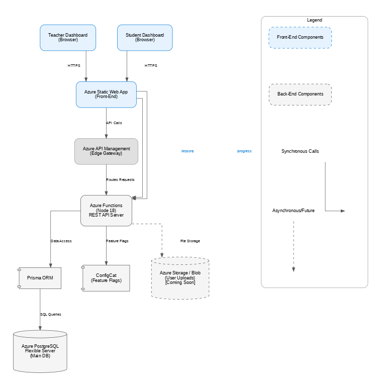

# Bright Boost – Back-End

## Overview

AWS Lambda (Node 18) with JWT authentication, Prisma ORM, and AWS Aurora PostgreSQL. The backend provides API endpoints for both teacher and student user roles, supporting the educational platform's core functionality.

## Architecture



The diagram above shows the target architecture for the BrightBoost backend, including the key components and their interactions.

## Quick Start

```bash
npm install              # installs packages
func start               # hot-reload dev server at http://localhost:7071
```

## AWS Aurora PostgreSQL Connection

The backend uses AWS Aurora PostgreSQL for data storage. Connection is configured via AWS Secrets Manager with the `DATABASE_SECRET_ARN` environment variable.

## Database Migrations

Prisma is used for database schema management and migrations:

```bash
# Apply migrations to development database
npx prisma migrate dev

# Apply migrations to production database
bash ./scripts/migrate-azure.sh
```

## Deployment

1. Deploy AWS Lambda:

```bash
sam deploy --guided
```

2. Configure environment variables in AWS Lambda:
   - DATABASE_SECRET_ARN
   - JWT_SECRET

## Database Models

The Prisma schema defines the following models:

- **User**: Teachers and students with authentication
  - Fields: id, name, email, password (hashed), role, createdAt, updatedAt
